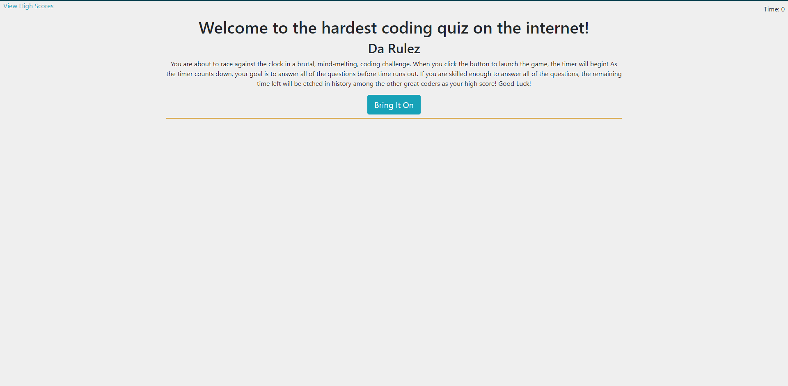
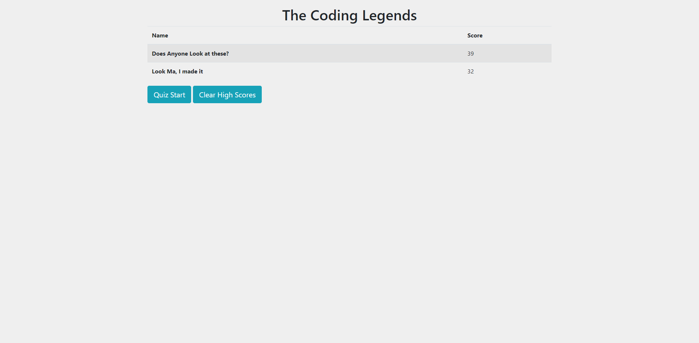

# coding-quiz
Description: This quiz is a browser game built from HTML, CSS, and vanilla JavaScript to create a quiz of web development questions. Users race against the clock for a chance to earn their name on the leaderboard.

Installation: None required

Usage: Follow the link https://mautrey17.github.io/coding-quiz/ to the quiz. Click on the "Bring it on" button to begin the quiz. In order to earn a place on the leader board, the quiz must be completed before the timer reaches 0.

